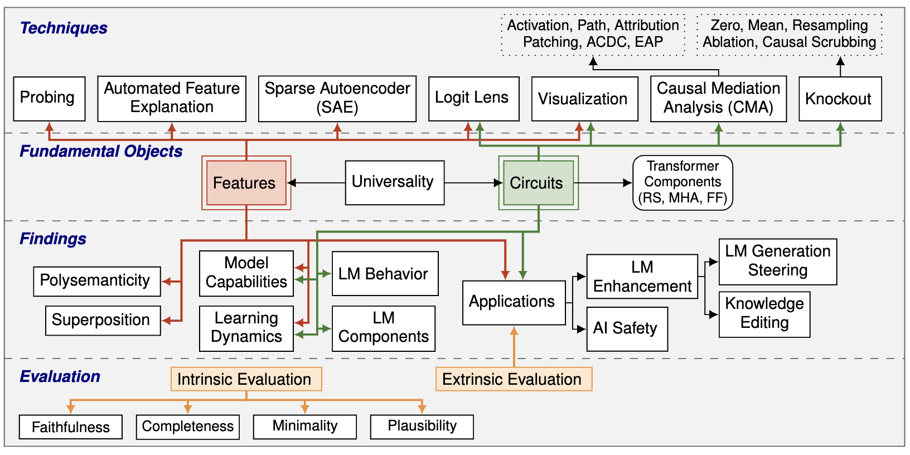
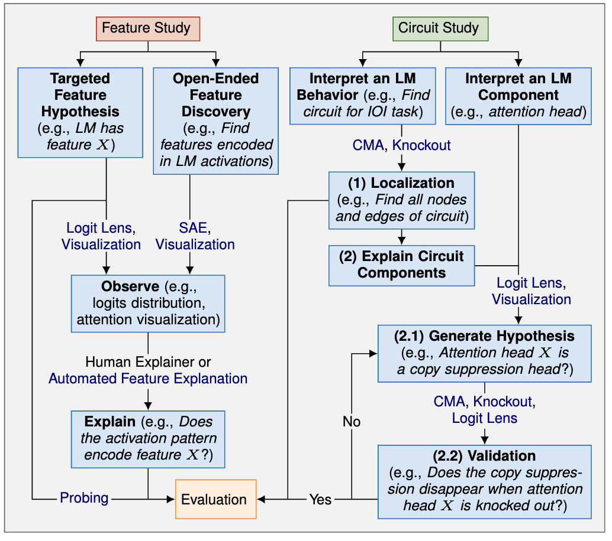

# awesome-mechanistic-interpretability-LM-papers

This is a collection of awesome papers about Mechanistic Interpretability (MI) for Transformer-based Language Models (LMs), organized following our survey paper: [A Practical Review of Mechanistic Interpretability for Transformer-Based Language Models](https://arxiv.org/pdf/2407.02646). 

Papers are organized following our **taxonomy (Figure 1)**. 
We have also curated a **Beginner's Roadmap (Figure 2)** with actionable items for interested people using MI for their purposes.

<div align="center">
  
  <p>Figure 1: Taxonomy</p>
</div>

<div align="center">
  
  <p>Figure 2: Beginner's Roadmap</p>
</div>

**How to Contribute:** We welcome contributions from everyone! If you find any relevant papers that are not included in the list, please categorize them following our taxonomy and submit a request for update.


**Questions/Comments/Suggestions:** If you have any questions/comments/suggestions to share with us, you are welcome to report an issue here or reach out to us through drai2@gmu.edu and ziyuyao@gmu.edu.

**How to Cite:** If you find our survey useful for your research, please cite our paper:
```
@article{rai2024practical,
  title={A Practical Review of Mechanistic Interpretability for Transformer-Based Language Models},
  author={Rai, Daking and Zhou, Yilun and Feng, Shi and Saparov, Abulhair and Yao, Ziyu},
  journal={arXiv preprint arXiv:2407.02646},
  year={2024}
}
```

## Updates
- June 2024: GitHub repository launched! Still under construction.

## Table of Contents
- [Techniques](#techniques)
- [Evaluation](#evaluation)
- [Findings and Applications](#findings-and-applications)
  - [Findings on Features](#findings-on-features)
  - [Findings on circuits](#findings-on-circuits)
    - [Interpreting LM Behaviors](#interpreting-lm-behaviors)
    - [Interpreting Transformer Components](#interpreting-transformer-components)
  - [Findings on Universality](#findings-on-universality)
  - [Findings on Model Capabilities](#findings-on-model-capabilities)
  - [Findings on Learning Dynamics](#findings-on-learning-dynamics)
  - [Applications of MI](#applications-of-mi)
- [Tools](#tools)

## Paper Collection

### Techniques 
([Back to Table of Contents](#table-of-contents))
|  Paper  |      Techniques    |      TL;DR    | 
| :----- | :-------------- | :----- | 
|  [Interpreting GPT: the logit lens](https://www.lesswrong.com/posts/AcKRB8wDpdaN6v6ru/interpreting-gpt-the-logit-lens)  |      Logit lens    |   The paper proposed the "logit lens" technique, which can be used to project intermediate activations into the vocabulary space for interpretation.      |
|  [Transformer Feed-Forward Layers Build Predictions by Promoting Concepts in the Vocabulary Space (EMNLP'22)](https://arxiv.org/pdf/2203.14680)  |      Logit lens    |   The paper showed that the "logit lens" can be used to project the second-layer of feed-forward parameter matrices into vocabulary space for interpretation.    | 
|  [Analyzing Transformers in Embedding Space (ACL'23)](https://arxiv.org/pdf/2209.02535)  |      Logit lens    |   The paper proposed a conceptual framework where all parameters of a trained Transformer are interpreted by projecting them into the vocabulary space.    |
|  [Eliciting Latent Predictions from Transformers with the Tuned Lens](https://arxiv.org/pdf/2303.08112)  |      Logit lens    |   The paper proposed using trained affine probes before logit lens to improve reliability, where these probes are translators which are used to transform the intermediate activations to align with the representation space of the final layer.    |
|  [Finding neurons in a haystack: Case studies with sparse probing (TMLR'23)](https://arxiv.org/pdf/2305.01610)  |      Probing    |   The paper proposed a sparse probing technique to localize a feature to a neuron or set of neurons in activations.    |
|  [Towards Monosemanticity: Decomposing Language Models With Dictionary Learning](https://transformer-circuits.pub/2023/monosemantic-features/index.html#appendix-autoencoder-dataset)  |      SAE    |   The paper provided advice for training SAEs, including the architecture, dataset, and other hyperparameters.    |
|  [Language models can explain neurons in language models](https://openaipublic.blob.core.windows.net/neuron-explainer/paper/index.html)  |      Automated Feature Explanation    |   The paper proposed using LLMs to generate feature labels automatically and a quantitative automatic explanation score to measure the quality of explanations.    |
|  [Interpretability in the Wild: a Circuit for Indirect Object Identification in GPT-2 small (ICLR'23)](https://arxiv.org/pdf/2211.00593)  |      Mean-ablation, Path Patching    |   The paper proposed to use mean-ablation for activation and path patching.     |
|  [Causal Scrubbing: a method for rigorously testing interpretability hypotheses [Redwood Research]](https://www.lesswrong.com/posts/JvZhhzycHu2Yd57RN/causal-scrubbing-a-method-for-rigorously-testing)  |      Random-ablation, Causal Scrubbing    |   The paper proposed random-ablation and causal ablation for evaluating the quality of mechanistic interpretation.     |
|  [Locating and Editing Factual Associations in GPT (NeurIPS'22) ](https://arxiv.org/pdf/2202.05262)  |      Activation Patching      |   The paper proposed to use activation patching to localize the layers that are responsible for the model’s factual predictions.     |
|  [Localizing Model Behavior with Path Patching](https://arxiv.org/pdf/2304.05969)  |      Path Patching    |   The paper introduced path patching, a technique for localizing the important paths in a circuit.     |
|  [Towards Automated Circuit Discovery for Mechanistic Interpretability (NeurIPS'23)](https://arxiv.org/pdf/2304.14997)  |      ACDC    |   The paper introduced ACDC algorithm  to automate the iterative localization process.     |
|  [Attribution Patching: Activation Patching At Industrial Scale](https://www.neelnanda.io/mechanistic-interpretability/attribution-patching)  |      Attribution Patching (AtP)    |   The blog proposed attribution patching, an efficient technique to approximate the results of activation patching.     |
|  [Attribution Patching Outperforms Automated Circuit Discovery](https://arxiv.org/pdf/2310.10348)  |      Edge Attribution Patching (EAP)    |   The paper introduced Edge Attribution Patching (EAP) as a more efficient alternative to ACDC for automatically identifying circuits.     |
|  [AtP*: An efficient and scalable method for localizing LLM behavior to components](https://arxiv.org/pdf/2403.00745)  |      Attribution Patching    |   The paper introduced a variant of AtP called AtP∗ that addresses some failure mode of AtP.     |

### Evaluation 
([Back to Table of Contents](#table-of-contents))
|  Paper  |      Evaluation    |      TL;DR    | 
| :----- | :-------------- |  :----- |
|  [Interpretability in the Wild: a Circuit for Indirect Object Identification in GPT-2 small (ICLR'23)](https://arxiv.org/pdf/2211.00593)  |      Faithfulness, Completeness, Minimality    |   The paper proposed ablation-based techniques for the faithfulness, completeness, and minimality evaluation of the discovered circuit.     |
| [Softmax Linear Units](https://transformer-circuits.pub/2022/solu/index.html) | Faithfulness | For evaluation, the paper recruited human annotators to rate the interpretation of a feature based on its activations over texts. |
| [Language models can explain neurons in language models](https://openai.com/index/language-models-can-explain-neurons-in-language-models/) | Faithfulness | The paper aimed to automate the faithfulness evaluation process. It introduced a quantitative automatic explanation score, specifically using a large LM to simulate activations based on the automatically generated labels and then comparing them with the ground-truth activations.|
| [Towards Monosemanticity: Decomposing Language Models With Dictionary Learning](https://transformer-circuits.pub/2023/monosemantic-features/index.html) | Plausibility | The paper found that attributing a model behavior to polysemantic neurons may be less plausible as compared to monosemantic ones. |


### Findings and Applications 
#### Findings on Features 
([Back to Table of Contents](#table-of-contents))
|  Paper  |      Techniques    |      Evaluation    |      TL;DR    | 
| :----- | :-------------- | :-------------- | :-------------- | 
|  [Softmax Linear Units](https://transformer-circuits.pub/2022/solu/index.html)  |   Visualization     |    N/A    |     The paper investigated the impact of changing the activation function in LMs from ReLU to the softmax linear unit on the polysemanticity of neurons. It discovered "Base64 neurons" as an example. |
| [Knowledge Neurons in Pretrained Transformers (ACL'22)](https://aclanthology.org/2022.acl-long.581.pdf) | Visualization | Extrinsic evaluation (Knowledge editing) | A gradient-based attribution score was designed, which discovered "knowledge neurons" in the FF layer of BERT.|
| [Finding skill neurons in pre-trained transformer-based language models (EMNLP'22)](https://aclanthology.org/2022.emnlp-main.765.pdf) | Knockout  | Faithfulness, Extrinsic Evaluation (model pruning, cross-task prompt transfer indicator)| "Skill neurons" in RoBERTa-base model. |
| [Neurons in Large Language Models: Dead, N-gram, Positional](https://arxiv.org/pdf/2309.04827) | Logit lens, Visualization | N/A | "Positional neurons". |
| [Toy Models of Superposition](https://transformer-circuits.pub/2022/toy_model/index.html) | Visualization | N/A | The paper confirmed the hypothesis of "superposition", where the authors showed that when features are sparse, the model tends to encode features in activation space using superposition. |
|  [Finding neurons in a haystack: Case studies with sparse probing (TMLR'23)](https://arxiv.org/pdf/2305.01610)  |      Probing    | Faithfulness  | The paper proposed a sparse probing technique to localize a feature to a neuron or set of neurons in activations and found examples of monosemanticty, polysemanticity, and superposition in LMs.    |
| [Towards Monosemanticity: Decomposing Language Models With Dictionary Learning](https://transformer-circuits.pub/2023/monosemantic-features/index.html) | SAE, Visualization, Automated Feature Explanation  | Plausibility, Automated Explanation Score, | The paper employed SAEs to extract features from representations implying superposition. |
| [Scaling Monosemanticity: Extracting Interpretable Features from Claude 3 Sonnet](https://transformer-circuits.pub/2024/scaling-monosemanticity/) | SAE, Visualization, Automated Feature Explanation  | Extrinsic Evaluation (LM Generation Steering)| The paper employed SAEs to extract features from representations implying superposition. |
|  [[Interim research report] Taking features out of superposition with sparse autoencoders](https://www.lesswrong.com/posts/z6QQJbtpkEAX3Aojj/interim-research-report-taking-features-out-of-superposition) | SAE  | N/A | The paper employed SAEs to extract features from representations implying superposition. |
| [ (tentatively) Found 600+ Monosemantic Features in a Small LM Using Sparse Autoencoders](https://www.lesswrong.com/posts/wqRqb7h6ZC48iDgfK/tentatively-found-600-monosemantic-features-in-a-small-lm) | SAE, Visualization | Faithfulness | The paper showed that the same components are reused by different circuits to implement different tasks. |
| [ Sparse Autoencoders Find Highly Interpretable Features in Language Models (ICLR'24)](https://arxiv.org/pdf/2309.08600) | SAE, Visualization | Automated Explanation Score, Knockout | The paper employed SAEs to extract features from representations implying superposition. |

#### Findings on circuits 
([Back to Table of Contents](#table-of-contents))
##### Interpreting LM Behaviors
|  Paper  |      Techniques    |      Evaluation    |      TL;DR    | 
| :----- | :--------------: | :--------------: | :--------------: | 
|  [In-context learning and induction heads.](https://transformer-circuits.pub/2022/in-context-learning-and-induction-heads/index.html)  |   Zero-Ablation, Visualization      |      Faithfulness    |      The paper demonstrated the importance of induction heads for in-context learning.    |
| [Towards automated circuit discovery for mechanistic interpretability (NeurIPS'23)](https://proceedings.neurips.cc/paper_files/paper/2023/file/34e1dbe95d34d7ebaf99b9bcaeb5b2be-Paper-Conference.pdf) | ACDC | Faithfulness | greater-than operations |
| [A circuit for python docstrings in a 4-layer attention-only transformer](https://www.lesswrong.com/posts/u6KXXmKFbXfWzoAXn/a-circuit-for-python-docstrings-in-a-4-layer-attention-only) | Activation Patching, Visualization | N/A | Python docstring formatting |
| [ Progress measures for grokking via mechanistic interpretability (ICLR'23)](https://arxiv.org/pdf/2301.05217) | Knockout, Visualization | Faithfulness | modular addition |
| [The clock and the pizza: Two stories in mechanistic explanation of neural networks (NeurIPS'23)](https://proceedings.neurips.cc/paper_files/paper/2023/file/56cbfbf49937a0873d451343ddc8c57d-Paper-Conference.pdf) | Logit lens, Visualization | N/A | modular addition |
| [Does circuit analysis interpretability scale? evidence from multiple choice capabilities in chinchilla](https://arxiv.org/pdf/2307.09458) | Logit lens, Visualization, Activation patching | N/A | The paper identified the circuit used for the multiple-choice question-answering task on the 70B Chinchilla LLM. |
| [Sparse feature circuits: Discovering and editing interpretable causal graphs in language models](https://arxiv.org/pdf/2403.19647) | SAE, Attribution Patching, Visualization | Faithfulness, Completeness, Plausibility, Extrinsic (Improving classifier generalization)| Sparse Feature Circuits for Subject–Verb Agreement  |
| [ Sparse autoencoders find highly interpretable features in language models (ICLR'24)](https://openreview.net/pdf?id=F76bwRSLeK) | SAE, Knockout | N/A | Discovered circuits connecting SAE features. |
| [Circuit component reuse across tasks in transformer language models (ICLR'24)](https://arxiv.org/pdf/2310.08744) | Activation patching, Path patching, Visualization  | N/A | The paper showed that the same components are reused by different circuits to implement different tasks. |
| [ Increasing trust in language models through the reuse of verified circuits](https://arxiv.org/pdf/2402.02619) | Knockout, Visualization, PCA | N/A | The paper showed that the same components are reused by different circuits to implement different tasks. |


##### Interpreting Transformer Components
|  Paper  |      Techniques    |      Evaluation    |      TL;DR    | 
| :----- | :-------------- | :-------------- | :-------------- | 
|  [A mathematical framework for transformer circuits](https://transformer-circuits.pub/2021/framework/index.html)  |   Visualization    |     N/A    |      The paper showed that the RS of LMs can be viewed as a one-way communication channel that transfers information from earlier to later layers. It also showed that each attention head in the MHA sublayer of a layer operates independently and can be interpreted independently. In addition, the paper discovered "copying heads" in MHA.|
|  [Interpreting GPT: the logit lens](https://www.lesswrong.com/posts/AcKRB8wDpdaN6v6ru/interpreting-gpt-the-logit-lens) | Visualization, Logit lens | N/A | The paper proposed to view the RS as an LM’s current "guess" for the output, which is iteratively refined layer-by-layer. |
| [Copy suppression: Comprehensively understanding an attention head](https://arxiv.org/pdf/2310.04625) | Logit lens, Mean-Ablation, Visualization | N/A | The paper discovered "negative heads" in GPT2-small that were responsible for reducing the logit values of the tokens that have already appeared in the context. |
| [Interpretability in the Wild: a Circuit for Indirect Object Identification in GPT-2 small](https://arxiv.org/pdf/2211.00593) | Path Patching, Knockout, Visualization | Faithfulness, Completeness, Minimality | Found "previous token heads" and "duplicate token heads" in MHA. |
| [In-context Learning and Induction Heads](https://transformer-circuits.pub/2022/in-context-learning-and-induction-heads/index.html) | Zero-Ablation, Visualization | Faithfulness | Induction heads in MHA. |
| [Successor Heads: Recurring, Interpretable Attention Heads In The Wild (ICLR'24)](https://openreview.net/forum?id=kvcbV8KQsi) | SAE, Probing, Knockout, Activation Patching | N/A | Successor heads in MHA. |
| [Finding Neurons in a Haystack: Case Studies with Sparse Probing (TMLR'23)](https://openreview.net/pdf?id=JYs1R9IMJr) | Probing | Faithfulness | FF sublayers are attributed for the majority of feature extraction. |
| [Locating and editing factual associations in gpt (NeurIPS'22)](https://arxiv.org/pdf/2202.05262) | Activation Patching | Extrinsic (Knowledge Editing) | FF sublayers are responsible for storing pre-trained knowledge. |
| [A Mechanistic Interpretation of Arithmetic Reasoning in Language Models using Causal Mediation Analysis (EMNLP'23)](https://aclanthology.org/2023.emnlp-main.435.pdf) | Activation Patching, Visualization | N/A | FF sublayers function for arithmetic computation. |
| [Transformer Feed-Forward Layers Are Key-Value Memories (EMNLP'21)](https://aclanthology.org/2021.emnlp-main.446.pdf) | Visualization | N/A | The paper viewed FF sublayers as key-value stores; they also demonstrated that earlier FF layers typically process shallow (syntactic or grammatical) input patterns, while later layers focus more on semantic patterns (e.g., text related to TV shows). |

#### Findings on Universality 
([Back to Table of Contents](#table-of-contents))
|  Paper  |  TL;DR     |
| :----- | :-------------- |
|  [Successor Heads: Recurring, Interpretable Attention Heads In The Wild](https://arxiv.org/pdf/2312.09230)  |    The paper identifies an interpretable set of attention heads, termed "successor heads", which perform incrementation in LMs (e.g., Monday -> Tuesday, second -> third) across various scales and architectures. |
| [In-context Learning and Induction Heads](https://transformer-circuits.pub/2022/in-context-learning-and-induction-heads/index.html) | Paper found induction heads across multiple LMs. |
| [Interpretability in the Wild: a Circuit for Indirect Object Identification in GPT-2 small](https://arxiv.org/pdf/2211.00593) | Paper found duplication heads across multiple LMs. |
| [Circuit component reuse across tasks in transformer language models (ICLR'24)](https://openreview.net/forum?id=fpoAYV6Wsk) | Paper found that different circuits implementing different tasks (IOI and colored objects task) reuse the same components (e.g., induction head), demonstrating universality across tasks |
| [Rethinking the Role of Scale for In-Context Learning: An Interpretability-based Case Study at 66 Billion Scale (ACL'23)](https://aclanthology.org/2023.acl-long.660.pdf) | The paper discussed the importance of each component in an OPT-66B model across 14 tasks and found that some attention heads were task-agnostic. |
| [The clock and the pizza: Two stories in mechanistic explanation of neural networks (NeurIPS'23)](https://openreview.net/forum?id=S5wmbQc1We) | Paper discovered that two LMs trained with different initialization can develop qualitatively different circuits for the modular addition task. |
| [A toy model of universality: Reverse engineering how networks learn group operations (ICML'23)](https://openreview.net/pdf?id=jCOrkuUpss) | Paper found that LMs trained to perform group composition on finite groups with different random weight initializations on the same task do not develop similar representations and circuits. |
| [Universal neurons in gpt2 language models](https://arxiv.org/pdf/2401.12181) | The paper found that only about 1-5% of neurons from GPT-2 models trained with random initialization exhibit universality. |


#### Findings on Model Capabilities 
([Back to Table of Contents](#table-of-contents))
|  Paper  |      Techniques    |      Evaluation    |      TL;DR    | 
| :----- | :-------------- | :-------------- | :-------------- | 
|  [A mathematical framework for transformer circuits](https://transformer-circuits.pub/2021/framework/index.html)  |   Visualization      |      N/A    |  Paper studied a simplified case of In-Context Learning and discovered an induction circuit composed of attention heads with specialized roles (e.g., induction heads).  |
| [In-context Learning and Induction Heads](https://transformer-circuits.pub/2022/in-context-learning-and-induction-heads/index.html) | Zero-Ablation, Visualization | Faithfulness | The paper discovered induction heads in In-Context Learning (ICL) and studied whether they provided the primary mechanisms for the majority of ICL. |
| [Rethinking the Role of Scale for In-Context Learning: An Interpretability-based Case Study at 66 Billion Scale (ACL'23)](https://aclanthology.org/2023.acl-long.660.pdf) | Zero-Ablation | Faithfulness, Extrinsic | The paper found that different transformer components have dramatically different contributions to In-Context Learning (ICL), such that removing the unimportant ones (70% attention heads and 20% FF) does not have a strong impact on model performance. |
| [Identifying Semantic Induction Heads to Understand In-Context Learning (ACL'24)](https://arxiv.org/pdf/2402.13055) | Visualization, Logit lens | Faithfulness | The paper investigated few-shot ICL and identified "semantic induction heads", which, unlike prior induction heads, model the semantic relationship between the input and the output token (e.g., "I have a nice pen for writing. The pen is nice to" -> "write"). |
| [A Mechanistic Interpretation of Arithmetic Reasoning in Language Models using Causal Mediation Analysis (EMNLP'23)](https://aclanthology.org/2023.emnlp-main.435.pdf) | Activation Patching, Visualization | N/A | The paper studied arithmetic reasoning and found that attention heads are responsible for transferring information from operand and operator tokens to the RS of the answer or output token, with FF modules subsequently calculating the answer token. |
| [How to think step-by-step: A mechanistic understanding of chain-of-thought reasoning (TMLR'24)](https://openreview.net/pdf?id=uHLDkQVtyC) |Activation patching, Mean-ablation, Probing, Logit lens | N/A | The paper studied chain-of-thought (CoT) multi-step reasoning over fictional ontologies and found that LLMs seem to deploy multiple different neural pathways in parallel to compute the final answer. |
| [An Investigation of Neuron Activation as a Unified Lens to Explain Chain-of-Thought Eliciting Arithmetic Reasoning of LLMs (ACL'24)](https://arxiv.org/pdf/2406.12288) | Logit Lens | Faithfulness | The paper investigated neuron activation as a unified lens to explain how CoT elicits arithmetic reasoning of LLMs, including phenomena that were only empirically discussed in prior work. |
| [A Mechanistic Analysis of a Transformer Trained on a Symbolic Multi-Step Reasoning Task](https://arxiv.org/pdf/2402.11917) | Probing, Activation patching, Causal Scrubbing | Faithfulness | The paper discovered an interpretable algorithm in LM for the task of pathfinding in trees. |


#### Findings on Learning Dynamics 
([Back to Table of Contents](#table-of-contents))
|  Paper  |      Techniques    |      Evaluation    |      TL;DR    | 
| :----- | :-------------- | :-------------- | :-------------- | 
|  [In-context learning and induction heads](https://transformer-circuits.pub/2022/in-context-learning-and-induction-heads/index.html)  |   Zero-Ablation, Visualization      |      Faithfulness    |      The paper showed that transformer-based LMs underwent a "phase change" early in training, during which induction heads formed and simultaneously in-context learning improved dramatically.    |
|  [Progress measures for grokking via mechanistic interpretability (ICLR'23)](https://arxiv.org/pdf/2301.05217)  |  Visualization     |    Faithfulness     |      The paper investigated the grokking phenomena during model training and showed that grokking, rather than being a sudden shift, consisted of three continuous phases: memorization, circuit formation, and cleanup.    |
|  [Explaining grokking through circuit efficiency](https://arxiv.org/pdf/2309.02390)  |    Visualization   |    N/A     |      The paper investigated the grokking phenomena as a consequence of models preferring the more efficient (in terms of parameter norm) "generalising circuits" over the less efficient "memorising circuits", and different training sizes (or the implied data complexities) lead to different efficiency cases. The paper also brought up the concepts of "ungrokking" and "semi-grokking".   |
|  [Sudden Drops in the Loss: Syntax Acquisition, Phase Transitions, and Simplicity Bias in MLMs](https://arxiv.org/pdf/2309.07311)  |  Visualization     |    Faithfulness     |      The paper showed that sudden drops in the loss during training corresponded to the acquisition of attention heads that recognized specific syntactic relation. Experiments were conducted on BERT.   |
|  [Unified View of Grokking, Double Descent and Emergent Abilities: A Perspective from Circuits Competition](https://arxiv.org/pdf/2402.15175)  |  Visualization     |   N/A      |      The paper provided a unified explanation for grokking, double descent, and emergent abilities as a competition between memorization and generalization circuits.  It particularly discussed the role of model size and extended the experiments to consider a multi-task learning paradigm.  |
| [Fine-tuning enhances existing mechanisms: A case study on entity tracking (ICLR'24)](https://arxiv.org/pdf/2402.14811) | Path Patching, Activation Patching | Faithfulness, Completeness, Minimaliity | The paper investigated the underlying changes in mechanisms (e.g., task-relevant circuits) to understand performance enhancements in finetuned LMs. The authors found that fine-tuning does not fundamentally change the mechanisms but enhances existing ones. |

#### Applications of MI 
([Back to Table of Contents](#table-of-contents))
|  Paper  |      Techniques    |      Evaluation    |      TL;DR    | 
| :----- | :-------------- | :-------------- | :-------------- | 
|  [Locating and Editing Factual Associations in GPT (NeurIPS'22)](https://arxiv.org/pdf/2202.05262)  |   Activation Patching      |      Extrinsic (Knowledge Editing)    |      The paper used activation patching to localize components that are responsible for storing factual knowledge, and then edited the fact (e.g., replacing "Seattle" with "Paris") by only updating the parameters of those components.    |
|  [Dissecting Recall of Factual Associations in Auto-Regressive Language Models (EMNLP'23)](https://arxiv.org/pdf/2202.05262)  |   Activation Patching      |      Faithfulness    |      The paper investigates how factual associations are stored and extracted internally in LMs, facilitating future research on knowledge localization and editing.     |
| [ Locating and editing factual associations in mamba](https://arxiv.org/pdf/2404.03646) | Activation Patching, Zero-Ablation | Faithfulness, Extrinsic (Knowledge Editing) | The paper explored locating, recalling, and editing facts in Mamba. |
| [Transformer Feed-Forward Layers Build Predictions by Promoting Concepts in the Vocabulary Space (EMNLP'22)](https://arxiv.org/pdf/2203.14680) | Logit Lens | Faithfulness, Extrinsic (Early exit prediction, toxic language generation impression)  | The paper suppressed toxic language generation by identifying and manually activating neurons in FF layers responsible for promoting non-toxic or safe words. It also showed that the concept promotion in the FF sublayer can be used for self-supervised early exit prediction for efficient model inference. |
| [Scaling Monosemanticity: Extracting Interpretable Features from Claude 3 Sonnet](https://transformer-circuits.pub/2024/scaling-monosemanticity/index.html) | SAE | Faithfulness, Extrinsic (LM generation steering) | The paper identified safety-related features (e.g., unsafe code, gender bias) and manipulated their activations to steer the LM towards (un)desired behaviors (e.g., safe code generation, unbiased text generation). |
| [Emergent linear representations in world models of self-supervised sequence models (ACL'23 BlackboxNLP)](https://aclanthology.org/2023.blackboxnlp-1.2.pdf) | Probing | Faithfulness, Extrinsic (LM generation steering) | The paper demonstrated that an LM’s output can be altered (e.g., flipping a player turn in the game of Othello from YOURS to MINE) by pushing its activation in the direction of a linear vector representing the desired behavior, which was identified using a linear probe. |
| [Toy Models of Superposition](https://transformer-circuits.pub/2022/toy_model/index.html) | N/A | N/A | The "enumeratibve safety" implication of superposition. |
| [What would be the most safety-relevant features in Language Models?](https://transformer-circuits.pub/2023/july-update/index.html#safety-features) | N/A | N/A | Discussion about feature discovery for AI safety. |
| [Eliciting latent predictions from transformers with the tuned lens](https://arxiv.org/pdf/2303.08112)| Logit Lens | Faithfulness, Extrinsic (Prompt injection detection) | Insights from circuit studies were used to detect prompt injection. |
| [Interpretability in the Wild: a Circuit for Indirect Object Identification in GPT-2 small](https://arxiv.org/pdf/2211.00593) | Mean-Ablation, Path Patching | Faithfulness, Completeness, Minimality, Extrinsic (Adversarial example generation) | Designing adversarial examples for the IOI task. |
| [Sparse Feature Circuits: Discovering and Editing Interpretable Causal Graphs in Language Models](https://arxiv.org/pdf/2403.19647) | SAE, Activation Patching | Faithfulness, Completeness, Extrinsic (Improving classifier generalization) | The paper improved the generalization of classifiers by identifying and ablating spurious features that humans consider to be task-irrelevant. |

### Tools 
([Back to Table of Contents](#table-of-contents))
|  Tool  |      TL;DR    | 
| :----- | :-------------- |
|  [CircuitsVis](https://github.com/TransformerLensOrg/CircuitsVis)  |  Library for attention visualization      | 

